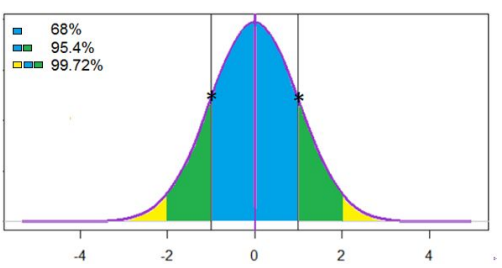

$$Probability_-theory - Math_-statistic$$

[*__LATEX__*](https://teletype.in/@dt_analytic/a1Ti2mtYooK)
математические формулы

#### Task_1. Расчет вероятности случайных событий
>"Комбинаторика, формула Байеса"

$$W(A) =\frac{m}{n};
C_n^k=\frac{n!}{k!(n-k)!};
A^k_n=\frac{n!}{(n-k)!};
P(B|A)=\frac{P(A|B)\cdot P(B))}{P(A)}$$

#### Task_2. Дискретные распределения вероятностей
>"Формула Бернулли, распределение Пуассона, биноминальная вероятность"

$$P_n(X=k) = C_n^k\cdot p^{k}\cdot q^{(n-k)};
P_m \approx\frac{\lambda^m}{m!}\cdot e^{-\lambda};
np-q\leq k_o \leq np+q$$

#### Task_3. EDA (exploratory data analysis) или Разведочный анализ
>"Математическое ожидание генеральной совокупности и выборки, дисперсия ген. совокупности (смещенная) и выборки (несмещенная <100), квартиль"

$$M(x) =\frac{1}{n} \sum^n_{i=1}x_i;
\bar{X} =\frac{1}{m} \sum^m_{i=1}x_i;
\sigma^2 = \frac{\sum_{i=1}^m(x_i-\bar{x})^2}{m};
s^2 = \frac{\sum_{i=1}^n(x_i-\bar{x})^2}{n-1};
Q = \frac{n\cdot k}{100}$$

#### Task_4. Непрерывная случайная величина
> "Нормальное распределение - Гаусса, стандартное нормальное распределение, описательная статистика равномерного распределения"

$$f(x) = \frac{1}{\sigma\sqrt{2\pi}}\cdot e^{-\frac{(x-a)^2}{2\sigma^2}};
z = \frac{x-\mu}{\sigma};
M(x) = \frac{a+b}{2};
D = \frac{(b-a)^2}{12}$$

>"Правило 3-х сигм"

#### Task_5. Тестирование гипотез
>"Статистическая гипотеза, P-value, критерий Стьюдента, тест Шапиро-Уилка"
[t_table](https://datascience.eu/ru/%D0%BC%D0%B0%D1%82%D0%B5%D0%BC%D0%B0%D1%82%D0%B8%D0%BA%D0%B0-%D0%B8-%D1%81%D1%82%D0%B0%D1%82%D0%B8%D1%81%D1%82%D0%B8%D0%BA%D0%B0/z-%D1%82%D0%B0%D0%B1%D0%BB%D0%B8%D1%86%D0%B0/)

$$H_0:\mu_1=\mu_0;
H_1:\mu_1>\mu_0;
z_n=\frac{\bar{x}-\mu}{\sigma/\sqrt{n}};
t_н=\frac{\bar{x}-\mu}{\sigma_н/\sqrt{n}};
Se = \frac{\sigma}{\sqrt{n}} $$

>"QQ график (quantile-quantile)

.png)

Task_6. Сравнение долей. Построение доверительного интервала.
>"Доверительный интервал, интервальная оценка, доверительный интервал для доли, сравнение долей"

$$\bar{x} \pm z_{\frac{\alpha}{2}}\cdot\frac{\sigma}{\sqrt{n}};
\Delta \pm t_{\frac{\alpha}{2}}\cdot S_\Delta;
\Delta = \bar{x}_1 - \bar{x}_2;
S_\Delta = \sqrt{\frac{D}{n_1}+\frac{D}{n_2}}$$

$$D = \frac{1}{2}(D_1+D_2);
\sigma = \sqrt{p(1-p)};
SE = \sqrt{\frac{p(1-p)}{n}};
p \pm z_{\frac{\alpha}{2}}\cdot SE$$

$$z = \frac{\bar{p}_1-\bar{p}_2}{\sqrt{p(1-p)(\frac{1}{n_1}+\frac{1}{n_2})}};
p = \frac{m_1+m_2}{n_1+n_2}$$

$$z = \frac{|\bar{p}_1-\bar{p}_2|-\frac{1}{2}(\frac{1}{n_1}+\frac{1}{n_2})}{\sqrt{p(1-p)(\frac{1}{n_1}+\frac{1}{n_2})}};
S_\Delta = \sqrt{P_{общ}(1-p_{общ})(\frac{1}{n_1}+\frac{1}{n_2})}$$

Task_7. Непараметрические тесты. (условия нормальности не собюдаются)
>"ранговый критерий Манна Уитни, Уилкоксона, Крускала - Уоллиса, Фридмана"

$$H = \frac{12}{N(N+1)}\cdot\sum^{k_j}_{i=1}\frac{T^2_j}{n_j}-3(N+1);
\bar{R} = \frac{n(k+1)}{2}$$

$$x^2_r = \frac{12}{n\cdot k(k+1)}\cdot\sum(R_i-\bar{R})^2$$

| Сравнение 2-х групп ||| Множественные сравнения ||
|:-:|:-|-|-:|:-:|
| Не зависимые | *Зависимые*  || Не зависимые     | *Зависимые* |
| Манна Уитни  | *Уилкоксона* || Крускала Уоллиса | *Фридмана*  |